# A Quadtree decomposition of heterogeneous materials in NURBS boundary representation

Consider a two-dimensional domain given by a simple closed polygonal chain and
a non-uniform rational B-spline (NURBS) curve, see Figure (a).  The polygonal chain correspond to the outer
boundary of the two-dimensional domain and the NURBS curve represents the
boundary of a hole or and inclusion.  

The Figures (a) - (f) illustrate the Quadtree subdivision of a two-dimensional
domain in boundary representation. 
The subdomain enclosed by the NURBS curve can represent a hole or an
inclusion. The corresponding finite element meshes are shown in Figures (g) and (h).

| | | |
| :---: | :---: | :---: |
| 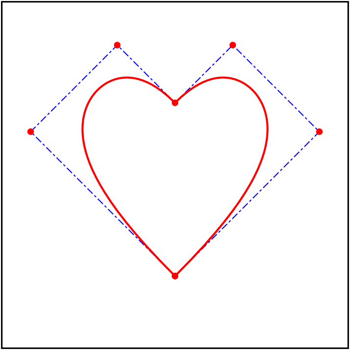 |   | 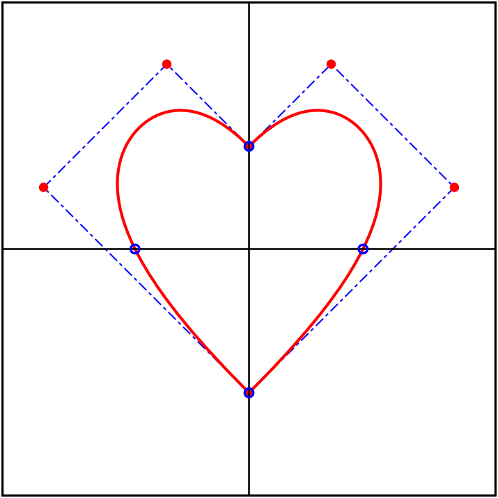 |
| (a)  | (b)  | (c) |
| 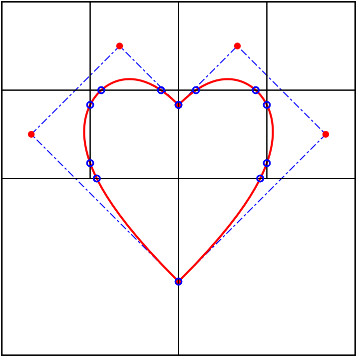 | 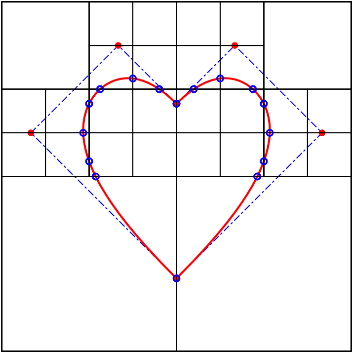 | 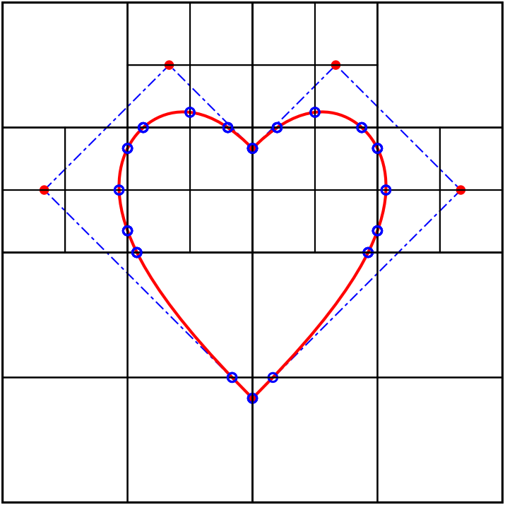 |
| (d) | (e) | (f) |
| 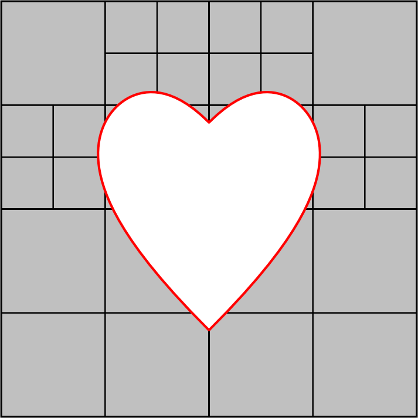 | 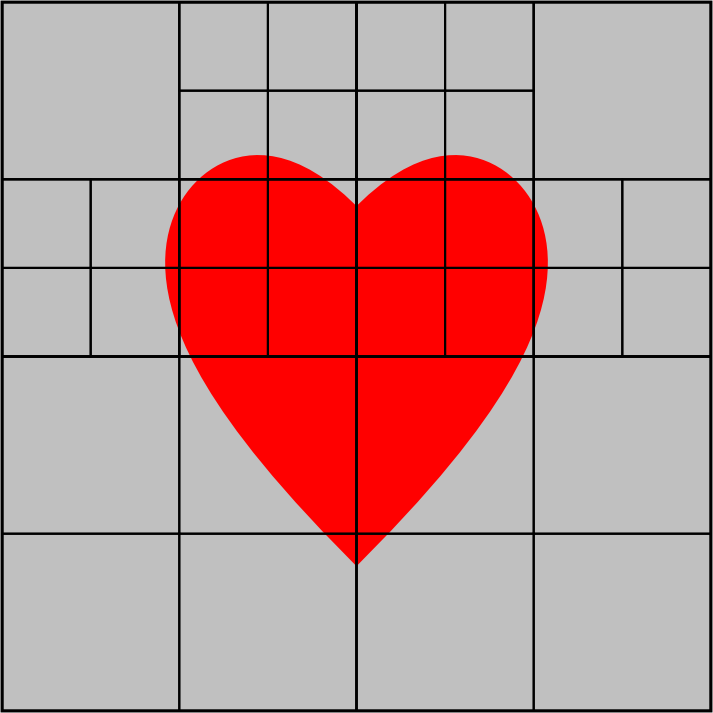 |  |
| (g) | (h) |  |

### Table of contents
1. [Examples](#examples)
1. [Dependencies](#dependencies)
1. [Acknowledgments](#acknowledgments)
1. [Contact](#contact)

## Dependencies

- [matlab-tree](https://github.com/tinevez/matlab-tree) [^1] - A MATLAB class.
  to represent the tree data structure

[^1]:  Jean-Yves Tinevez (2023). Tree data structure as a MATLAB class
(https://github.com/tinevez/matlab-tree), GitHub. Retrieved February 23, 2023.

## Examples

| Two-dimensional domain | Quadtree decomposition |
| :---: | :---: |
|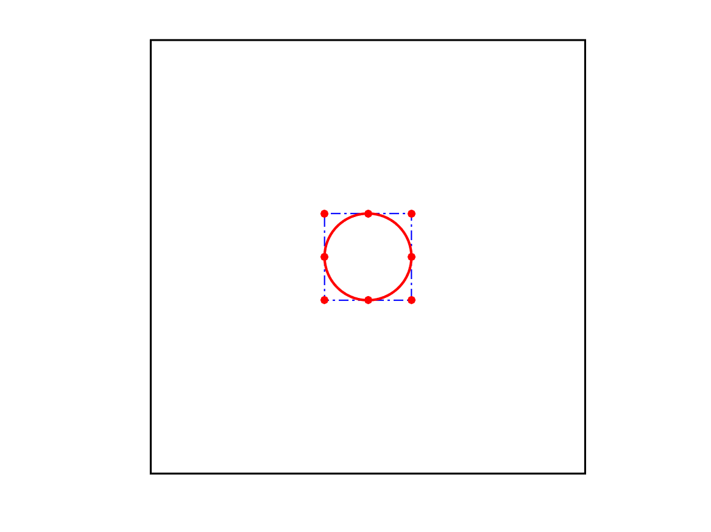 | 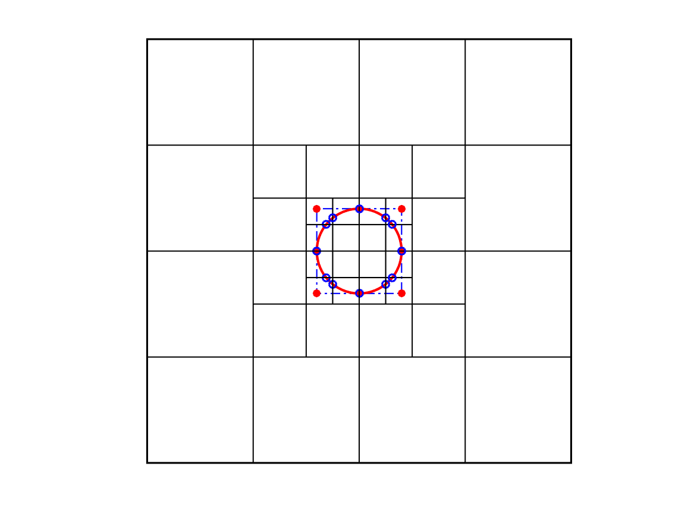 |
|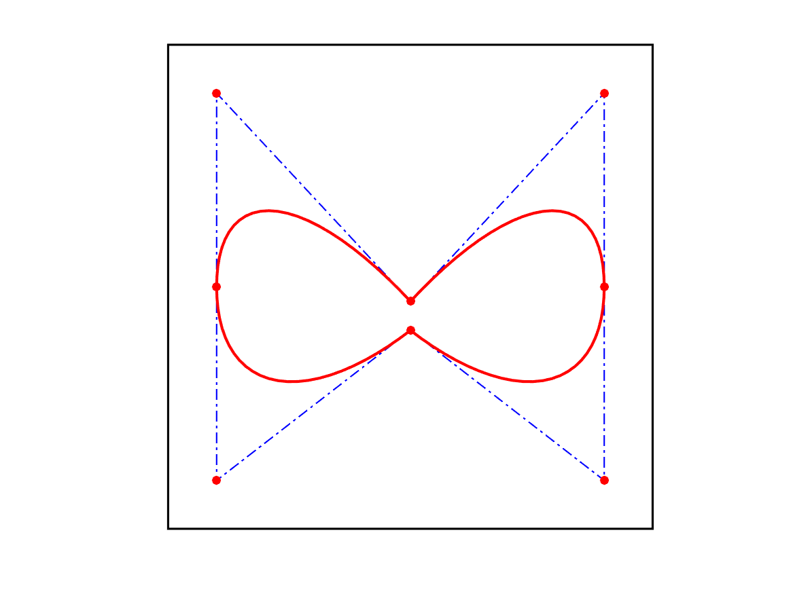 | 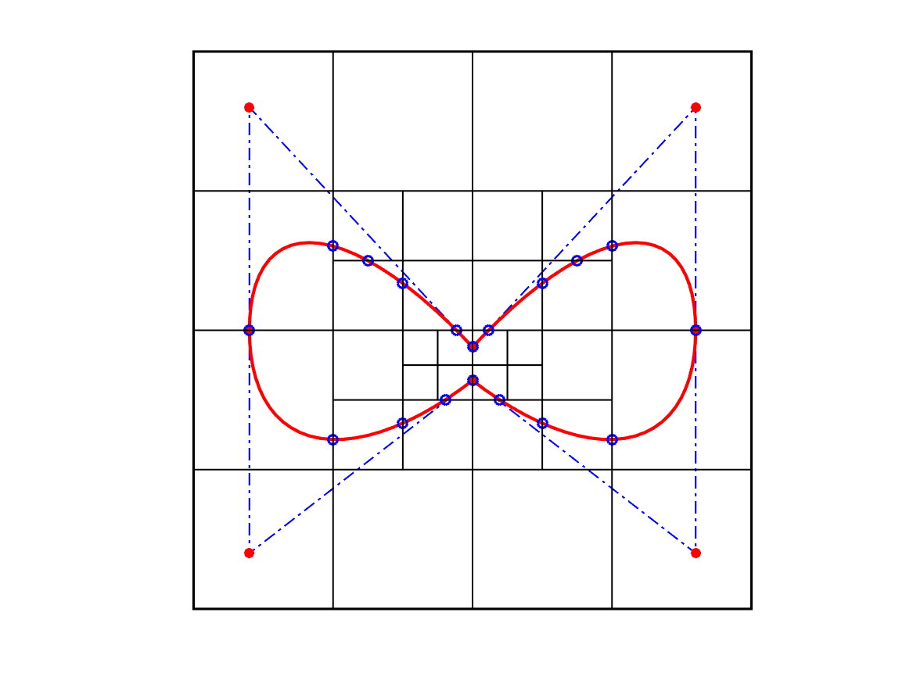 |
|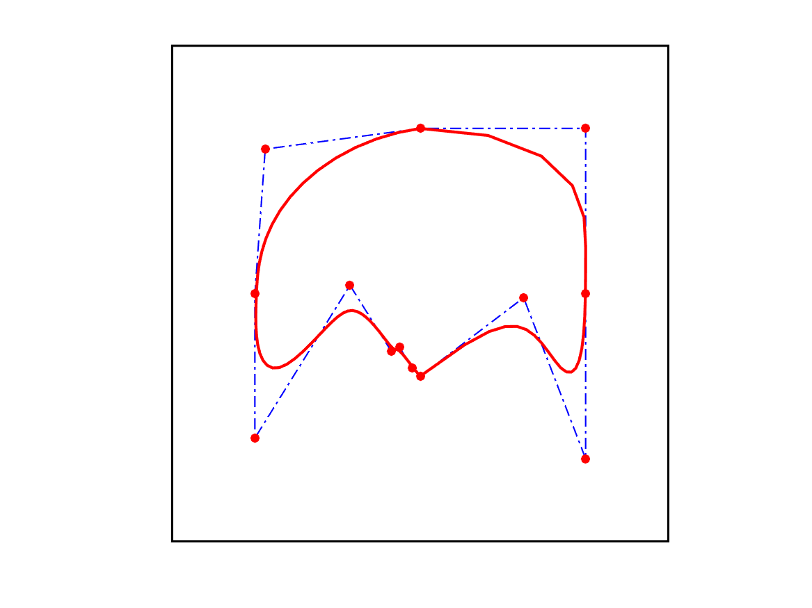 | 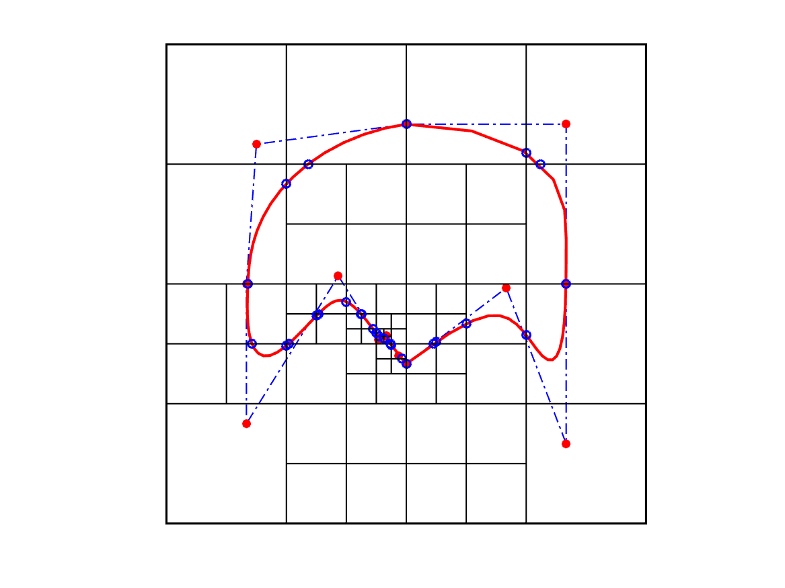 |
|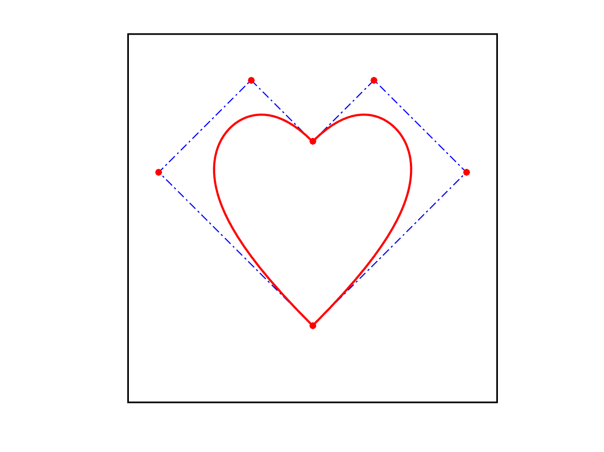 | 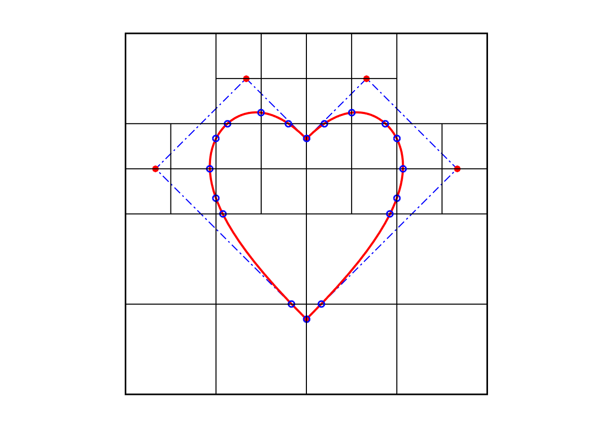 |

## Acknowledgments 

The financial support of the DFG (German Research Foundation) under 
[project number 433734847](https://gepris.dfg.de/gepris/projekt/433734847?language=en)
is gratefully acknowledged.

## Contact   

**Rainer Reichel** M.Sc.  
LBB - Lehrstuhl für Baustatik und Baudynamik  
RWTH Aachen University 
email: <reichel@lbb.rwth-aaachen.de>

